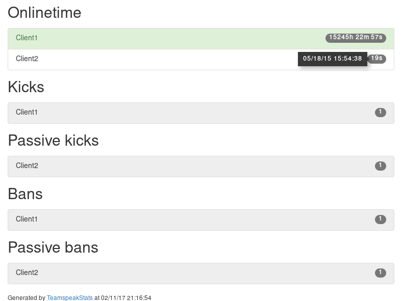

# TeamspeakStats [](https://travis-ci.org/Thor77/TeamspeakStats) [](https://coveralls.io/github/Thor77/TeamspeakStats?branch=master) [](https://landscape.io/github/Thor77/TeamspeakStats/master) [](https://pypi.python.org/pypi/tsstats) [](http://teamspeakstats.readthedocs.io/en/latest/?badge=latest)
A simple Teamspeak stat-generator - based solely on server-logs



# Installation
- Install the package via PyPi `pip install tsstats`
- Clone this repo `git clone https://github.com/Thor77/TeamspeakStats` and install with `python setup.py install`
- Just use the package as is via `python -m tsstats [-h]`

# Usage
- Run the script `tsstats [-h]`
- Optionally create a config-file (see [Configuration](https://github.com/Thor77/TeamspeakStats#configuration))
- The package works entirely off your Teamspeak server's logs, so that no ServerQuery account is necessary

# Example
```
tsstats -l /var/log/teamspeak3-server/ts3server*.log -o /var/www/tsstats.html
```

Parse logs matching `ts3server*.log` in `/var/log/teamspeak3-server` and write output to `/var/www/tsstats.html`.

# CLI-Usage
```
usage: tsstats [-h] [-c CONFIG] [--idmap IDMAP] [-l LOG] [-o OUTPUT] [-d]
                   [-nod]

A simple Teamspeak stats-generator - based solely on server-logs

optional arguments:
  -h, --help            show this help message and exit
  -c CONFIG, --config CONFIG
                        path to config
  --idmap IDMAP         path to id_map
  -l LOG, --log LOG     path to your logfile(s)
  -o OUTPUT, --output OUTPUT
                        path to the output-file
  -d, --debug           debug mode
  -nod, --noonlinedc    don't add connect until now to onlinetime
  -t TEMPLATE, --template TEMPLATE
                        path to custom template
  -dtf DATETIMEFORMAT, --datetimeformat DATETIMEFORMAT
                        format of date/time-values (datetime.strftime)
  -otth ONLINETIMETHRESHOLD, --onlinetimethreshold ONLINETIMETHRESHOLD
                        threshold for displaying onlinetime (in seconds)
```

# Configuration

#### [General]
| Key | Description |
|-----|-------------|
| log | Path to TS3Server-logfile(s) (supports [globbing](https://docs.python.org/3/library/glob.html)) |
| output | Path to the location, where the generator will put the generated `.html`-file |
| idmap | Path to [IdentMap](http://teamspeakstats.readthedocs.io/en/latest/identmap.html) |
| debug | debug mode |
| onlinedc | Add timedelta from last-connect until now to onlinetime for connected clients |
| template | Path to a custom template file (relative from `tsstats/` or absolute) |
| datetimeformat | Format of date/time-values used for render-timestamp and last online (using [datetime.strftime](https://docs.python.org/3/library/datetime.html#strftime-strptime-behavior)) |
| onlinetimethreshold | Clients with an onlinetime below that threshold (in seconds) are hidden in the onlinetime-section |


## Example
```
[General]
log = /usr/local/bin/teamspeak-server/logs/ts3server*_1.log
output = /var/www/html/stats.html
```

# Contributing
Please make sure tests are succeeding and your code follows [flake8](https://flake8.readthedocs.io)-guidelines.

## Run tests
- Install testing-requirements `pip install -r testing_requirements.txt`
- Run `py.test tsstats/`

# TODO
- Localization
